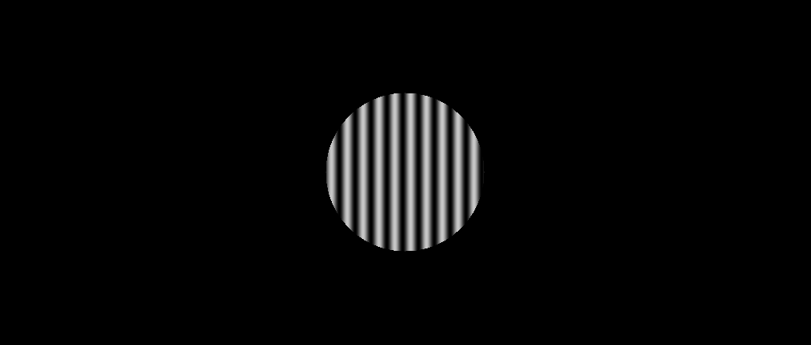
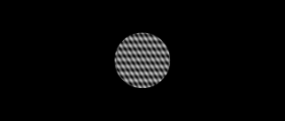
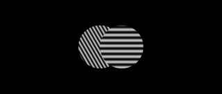
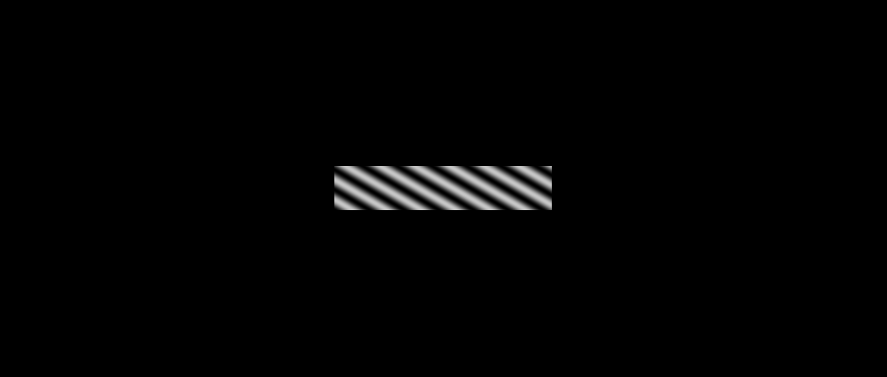
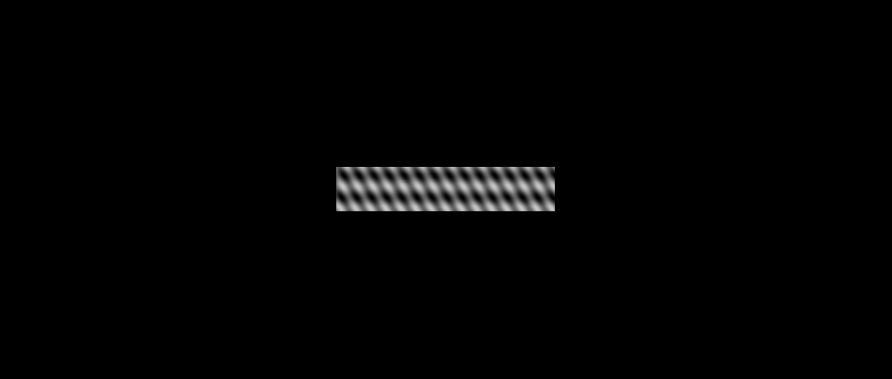
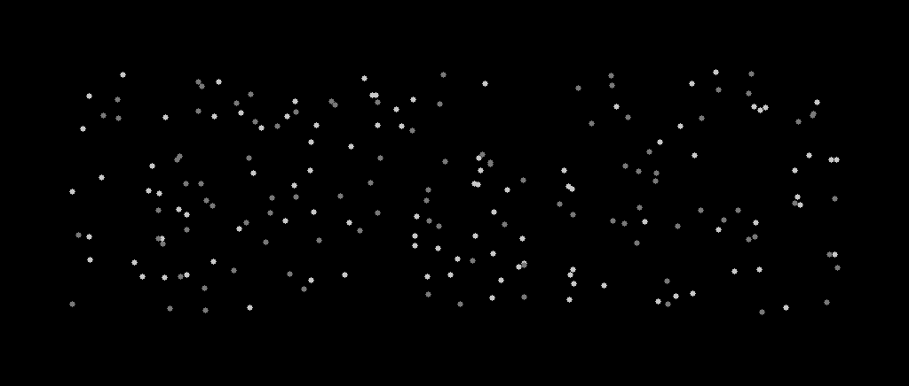
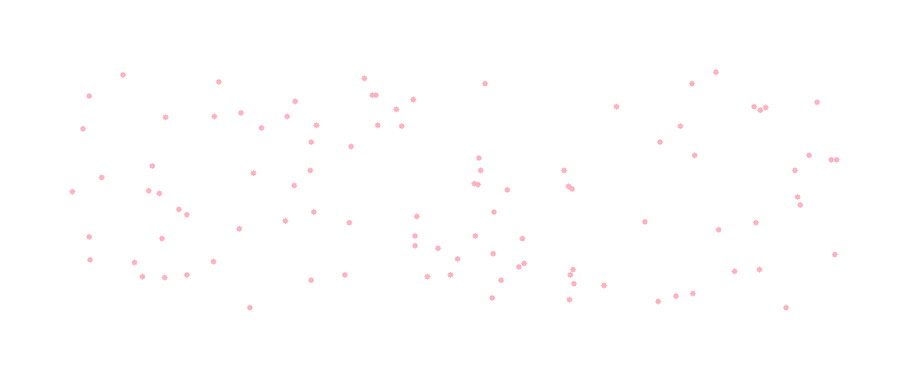
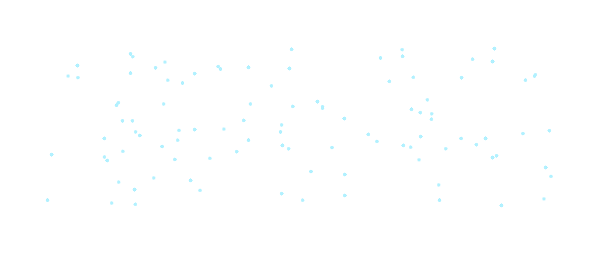
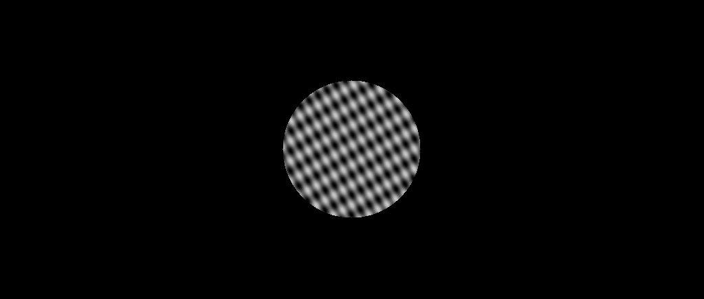

# Wallach: A Psychophysical Optical Flow Benchmark

A synthetic dataset generator for dense optical flow estimation using classical psychophysical stimuli. Unlike standard benchmarks (Sintel, FlyingChairs) that use rendered scenes, this project generates controlled motion stimuli grounded in **visual neuroscience** and **motion perception research**, providing pixel-perfect ground truth flow fields.

Named after [Hans Wallach](https://en.wikipedia.org/wiki/Hans_Wallach), a pioneer in the study of motion perception and the aperture problem.

---

## Table of Contents

- [Motivation](#motivation)
- [Stimulus Types](#stimulus-types)
- [Dataset Structure](#dataset-structure)
- [Installation](#installation)
- [Quick Start](#quick-start)
- [Sample Gallery](#sample-gallery)
- [Configuration](#configuration)
- [Evaluation Metrics](#evaluation-metrics)
- [PyTorch DataLoader](#pytorch-dataloader)
- [Leaderboard](#leaderboard)
- [References](#references)

---

## Motivation

Standard optical flow benchmarks evaluate methods on naturalistic scenes, but they do not isolate **fundamental motion perception challenges** that have been studied for decades in psychophysics and neuroscience:

| Challenge | Psychophysical Phenomenon | Stimulus |
|-----------|--------------------------|----------|
| Local motion ambiguity | **Aperture Problem** | Lines, Gratings |
| Motion integration | **Intersection of Constraints (IoC)** | Plaids |
| Feature tracking | **Correspondence Problem** | Circles, Rectangles |
| Component vs. pattern motion | **Wallach's Rule** | Hybrid Plaids |
| Elongated aperture bias | **Barber Pole Illusion** | Barber Poles, Barber Plaids |
| Multi-surface segmentation | **Transparent Motion** | Transparent Dots, Transparent Gratings |
| Speed/direction tuning | **Velocity Space Sampling** | All types |

This benchmark lets you test whether an optical flow method can solve these **foundational motion problems** before trusting it on complex real-world scenes.

---

## Stimulus Types

### 1. Moving Circles
Filled discs and circle perimeters translating at controlled velocities. Tests basic feature tracking and correspondence.

```
Parameters: radius {21, 42} px | type {perimeter, filled} | contrast [1-255]
```

### 2. Moving Lines
Oriented line segments translating rigidly. Probes the **aperture problem** -- a line's motion perpendicular to its orientation is ambiguous.

```
Parameters: length {10, 20, 30} px | orientation {0, 30, 60, 90, 120, 150}deg
```

### 3. Moving Rectangles
Oriented rectangles with variable aspect ratios. Varying aspect ratio controls how much the shape resembles a line (high ambiguity) vs. a square (low ambiguity).

```
Parameters: length {10, 25, 50} px | aspect_ratio {0.5, 1.0, 1.5} | orientation {0-150}deg
```

### 4. Moving Gratings
Sinusoidal gratings within circular apertures. A single grating has a 1D motion constraint -- only the **component velocity** (normal to grating orientation) is defined.

```
Parameters: aperture_radius {50, 75, 100, 125} px | frequency {1/10, 1/20, 1/30} cpf
           orientation {0-150}deg | speed via v = f_temporal / f_spatial
```

### 5. Moving Plaids
Two superimposed gratings at different orientations/frequencies within a circular aperture. The veridical 2D velocity is computed via the **Intersection of Constraints (IoC)** rule.

```
Parameters: aperture_radius {100} px | frequencies: pairs from {1/10, 1/20, 1/30}
           orientation_offset {30, 45, 60, 75, 90}deg
```

### 6. Hybrid Plaids
Two gratings presented in spatially separated (left/right) circular apertures, each moving independently. Tests whether methods can handle **transparent motion** and local vs. global integration.

```
Parameters: aperture_radius {100} px | grating_offset {50} px
           frequencies, orientations same as plaids
```

### 7. Barber Poles
A sinusoidal grating viewed through an **elongated rectangular aperture**. The classic barber pole illusion: the grating's true motion is normal to its orientation (component velocity), but perception shifts toward the aperture's long axis. Ground truth provides **two flow layers**: component velocity and barber-pole-predicted velocity.

```
Parameters: rect_length {200, 300} px | rect_width {40, 60} px
           grating_orientations {0-150}deg | aperture_orientations {0, 45, 90, 135}deg
           frequencies {1/10, 1/20, 1/30} cpf
```

### 8. Barber Plaids
A plaid pattern (two superimposed gratings) viewed through an elongated rectangular aperture. Combines the IoC computation of plaids with the aperture geometry of barber poles. Ground truth provides both the **IoC velocity** and the **barber-pole-biased velocity** (IoC projected onto the aperture axis).

```
Parameters: rect_length {200, 300} px | rect_width {40, 60} px
           aperture_orientations {0, 45, 90, 135}deg
           frequencies, orientations same as plaids
```

### 9. Transparent Motion (Random Dots)
Two populations of random dots occupy the **same spatial region**, each moving coherently in a different direction. The visual system perceives two transparent surfaces sliding over each other. Ground truth provides **per-surface flow layers** and a surface-membership mask.

```
Parameters: num_dots {200, 400} | dot_radius {2, 4} px
           speed_pairs: (3,5), (5,5), (3,10), (8,8) px/frame
           direction_pairs: (0,180), (0,90), (45,225), (30,150), (0,120), (60,300) deg
```

### 10. Transparent Motion (Overlapping Gratings)
Two gratings at different orientations/speeds superimposed within a circular aperture, but unlike standard plaids, the ground truth preserves **each grating's component velocity as a separate surface layer**. Also provides the IoC velocity for comparison. Tests whether a method can decompose motion into two transparent surfaces rather than computing a single averaged velocity.

```
Parameters: aperture_radius {100} px | frequencies: pairs from {1/10, 1/20, 1/30}
           orientation_offset {30-90}deg
```

---

## Dataset Structure

```
Stimuli/
  +-- {stimulus_type}_images/           # RGB image sequences
  |     +-- {name}_VX_XXXX_VY_XXXX__00.png   # Frame t-2
  |     +-- {name}_VX_XXXX_VY_XXXX__01.png   # Frame t-1
  |     +-- {name}_VX_XXXX_VY_XXXX__02.png   # Frame t   (center)
  |     +-- {name}_VX_XXXX_VY_XXXX__03.png   # Frame t+1
  |     +-- {name}_VX_XXXX_VY_XXXX__04.png   # Frame t+2
  +-- {stimulus_type}_GT/               # Ground truth optical flow
        +-- {name}_VX_XXXX_VY_XXXX__00.flo   # Middlebury .flo format
        +-- {name}_VX_XXXX_VY_XXXX__00.png   # Color-coded visualization
```

### Multi-Layer Ground Truth (Barber Poles, Transparent Motion)

Stimuli with multiple motion interpretations provide separate GT directories:

```
Stimuli/
  +-- barberpole_*_GT/                  # Component velocity (normal to grating)
  +-- barberpole_*_GT_barberpole/       # Barber-pole-predicted velocity (along aperture axis)
  +-- barberplaid_*_GT/                 # IoC velocity
  +-- barberplaid_*_GT_barberpole/      # Barber-pole-biased velocity
  +-- transparent_ndots_*_GT_surface1/  # Flow for dot surface 1
  +-- transparent_ndots_*_GT_surface2/  # Flow for dot surface 2
  +-- transparent_ndots_*_masks/        # Surface membership (1=S1, 2=S2)
  +-- transparent_gratings_*_GT_surface1/  # Component velocity of grating 1
  +-- transparent_gratings_*_GT_surface2/  # Component velocity of grating 2
  +-- transparent_gratings_*_GT_ioc/       # IoC velocity (for comparison)
```

### Filename Encoding

```
circles_full_r21_c128_VX_0005_VY_-010__02.png
|       |    |   |     |       |       |
|       |    |   |     |       |       +-- Frame index (00-04)
|       |    |   |     |       +-- Vertical velocity (px/frame)
|       |    |   |     +-- Horizontal velocity (px/frame)
|       |    |   +-- Contrast value
|       |    +-- Radius in pixels
|       +-- Fill type (full/perimeter)
+-- Stimulus category
```

### Flow File Format (.flo)

Standard Middlebury format (compatible with MPI-Sintel):
- Header: Magic number `202021.25` (float32)
- Dimensions: Width, Height (int32 each)
- Data: Interleaved (u, v) float32 pairs

### Optical Flow Convention

```
        0deg (up, -VY)
            |
  270deg ---+--- 90deg (+VX, right)
            |
       180deg (+VY, down)
```

- `VX > 0`: motion towards the right (3 o'clock)
- `VY > 0`: motion towards the bottom (6 o'clock)

---

## Installation

### Option A: Docker Compose (Recommended)

No local dependency setup needed. Requires only [Docker](https://docs.docker.com/get-docker/) and [Docker Compose](https://docs.docker.com/compose/install/).

```bash
git clone https://github.com/<your-username>/OpticalFlow.git
cd OpticalFlow

# Generate sample images (one per stimulus type)
docker compose run samples

# Generate the full dataset
docker compose run generate

# Evaluate your method's predictions
METHOD_NAME="RAFT" docker compose run evaluate

# Interactive development shell
docker compose run dev
```

### Option B: Local Install

```bash
pip install -r requirements.txt
```

For PyTorch dataset loaders:
```bash
pip install torch torchvision
```

### Clone

```bash
git clone https://github.com/<your-username>/OpticalFlow.git
cd OpticalFlow
```

---

## Quick Start

### Docker Compose Workflow

```bash
# 1. Generate samples (quick sanity check)
docker compose run samples
# -> outputs to ./samples/

# 2. Generate full dataset (all stimulus types x all velocities)
docker compose run generate
# -> outputs to ./output/

# 3. Run your method on the generated images, save .flo files to ./predictions/

# 4. Evaluate
METHOD_NAME="YourMethod" docker compose run evaluate
```

### Local Workflow

#### Generate the Full Dataset

```bash
python GenerateStimuli_main.py
```

This generates all 6 stimulus types with logarithmically sampled velocities (range: -25 to +25 px/frame, 17 values per axis). Image resolution: **1024 x 436** pixels. Output is saved to the configured `base_dir`.

#### Generate a Single Sample (Minimal Example)

```python
from GenerateMovingStimuli import GenerateMovingCircle
import numpy as np

vel_tsample = np.logspace(0.1, np.log10(25), 8, endpoint=True)
vel_sample = np.round(np.concatenate((-1*vel_tsample[::-1], [0], vel_tsample), axis=0)).astype(int)

GenerateMovingCircle(
    Height=436, Width=1024,
    circle_radius=42,
    circ_type='full',        # or 'perimeter'
    vel_sample=vel_sample,
    Results_base_dir='./output/'
)
```

#### Visualize Flow Ground Truth

```python
from utils.flow_io import flow_read
from utils.viz_flow import viz_flow
import cv2

u, v = flow_read('path/to/flow.flo')
flow_rgb = viz_flow(u, v)
cv2.imwrite('flow_vis.png', cv2.cvtColor(flow_rgb, cv2.COLOR_RGB2BGR))
```

---

## Sample Gallery

Generated via `python generate_samples.py` -- creates one example of each stimulus type in `samples/`.

### Circle (filled)
| Image | Ground Truth Flow |
|-------|-------------------|
|  |  |

### Circle (perimeter)
| Image | Ground Truth Flow |
|-------|-------------------|
|  |  |

### Line
| Image | Ground Truth Flow |
|-------|-------------------|
|  |  |

### Rectangle
| Image | Ground Truth Flow |
|-------|-------------------|
|  |  |

### Grating
| Image | Ground Truth Flow |
|-------|-------------------|
|  |  |

### Plaid (Intersection of Constraints)
| Image | Ground Truth Flow |
|-------|-------------------|
|  |  |

### Hybrid Plaid
| Image | Ground Truth Flow |
|-------|-------------------|
|  |  |

### Barber Pole (Component vs. Perceived Motion)
| Image | Component Flow (Normal to Grating) | Perceived Flow (Along Aperture Axis) |
|-------|-------------------------------------|--------------------------------------|
|  |  |  |

### Barber Plaid (IoC vs. Aperture-Biased)
| Image | IoC Flow | Aperture-Biased Flow |
|-------|----------|----------------------|
|  |  |  |

### Transparent Motion -- Random Dots (Two Surfaces)
| Image | Surface 1 Flow | Surface 2 Flow |
|-------|----------------|----------------|
|  |  |  |

### Transparent Motion -- Overlapping Gratings (Two Surfaces)
| Image | Surface 1 Flow | Surface 2 Flow |
|-------|----------------|----------------|
|  |  |  |

Run `python generate_samples.py` to regenerate these samples locally.

---

## Configuration

Edit `dataset_config_base.yaml`:

```yaml
Dataset: Wallach
stimuli_types: [circles, rectangles, lines, gratings, plaids, hybridplaids]

circles:
  params:
    contrast: [255]
    radii: [120]
    isfilled: ['True', 'False']
    velocities: [(1.0, 0.2)]

gratings:
  params:
    contrast: ...
    frequency: ...
    aperture: ...
    orientation: ...
    speed: ...
```

### Velocity Sampling

Velocities are sampled on a **logarithmic scale** to provide denser coverage at low speeds (where many methods struggle):

```python
vel_tsample = np.logspace(0.1, np.log10(25), 8, endpoint=True)
# Results in: [1.26, 1.73, 2.38, 3.27, 4.50, 6.18, 8.50, 25.0] (rounded)
# Mirrored with negatives and zero: 17 values total per axis
```

---

## Evaluation Metrics

The toolkit provides standard optical flow evaluation metrics in `utils/pcautils.py`:

| Metric | Function | Description |
|--------|----------|-------------|
| **EPE** | `epe_u_v(u_gt, v_gt, u_est, v_est)` | End-Point Error: Euclidean distance between predicted and GT flow vectors, averaged over all pixels |
| **AE** | `angerrors_feats_u_v(kp0, kp1, u_gt, v_gt)` | Angular Error: angle between predicted and GT flow directions |
| **Feature EPE** | `errors_feats_u_v(kp0, kp1, u_gt, v_gt)` | EPE computed at sparse feature point locations |

### Running Evaluation

```python
from utils.pcautils import epe_u_v
from utils.flow_io import flow_read

u_gt, v_gt = flow_read('ground_truth.flo')
u_est, v_est = flow_read('prediction.flo')

epe = epe_u_v(u_gt, v_gt, u_est, v_est)
print(f"End-Point Error: {epe:.4f} px")
```

---

## PyTorch DataLoader

```python
import argparse
from datasets import Wallach

args = argparse.Namespace(
    crop_size=[384, 512],
    inference_size=[-1, -1]  # auto-adjusted to multiples of 64
)

dataset = Wallach(args, root='/path/to/Stimuli/Hyderabad/flow/')
images, flow = dataset[0]
# images: [C, 2, H, W] tensor (image pair)
# flow:   [2, H, W] tensor (u, v)
```

Also supports standard benchmarks: `MpiSintelClean`, `MpiSintelFinal`, `FlyingChairs`, `FlyingThings`, `ChairsSDHom`.

---

## Leaderboard

Benchmark results on the Wallach psychophysical test set. Methods are evaluated per-stimulus-type using **End-Point Error (EPE)** in pixels/frame and **Angular Error (AE)** in degrees. Lower is better.

### Overall Results

| Rank | Method | Type | Circles | Lines | Rects | Gratings | Plaids | Hyb.Plaids | Barber Poles | Barber Plaids | Transp.Dots | Transp.Gratings | **Mean EPE** | **Mean AE** |
|------|--------|------|---------|-------|-------|----------|--------|------------|--------------|---------------|-------------|-----------------|--------------|-------------|
| 1 | *Your method* | - | - | - | - | - | - | - | - | - | - | - | **-** | **-** |

### Per-Category Breakdown

#### Circles (Feature Tracking)

| Rank | Method | Filled EPE | Perimeter EPE | r=21 EPE | r=42 EPE | Mean EPE |
|------|--------|------------|---------------|----------|----------|----------|
| - | Horn-Schunck | - | - | - | - | - |
| - | Lucas-Kanade | - | - | - | - | - |
| - | PWC-Net | - | - | - | - | - |
| - | RAFT | - | - | - | - | - |
| - | FlowNet2 | - | - | - | - | - |

#### Lines (Aperture Problem)

| Rank | Method | l=10 EPE | l=20 EPE | l=30 EPE | Mean EPE | Mean AE |
|------|--------|----------|----------|----------|----------|---------|
| - | Horn-Schunck | - | - | - | - | - |
| - | Lucas-Kanade | - | - | - | - | - |
| - | PWC-Net | - | - | - | - | - |
| - | RAFT | - | - | - | - | - |

#### Rectangles (Aperture vs. Feature)

| Rank | Method | AR=0.5 EPE | AR=1.0 EPE | AR=1.5 EPE | Mean EPE |
|------|--------|------------|------------|------------|----------|
| - | Horn-Schunck | - | - | - | - |
| - | PWC-Net | - | - | - | - |
| - | RAFT | - | - | - | - |

#### Gratings (Component Motion)

| Rank | Method | R=50 EPE | R=75 EPE | R=100 EPE | R=125 EPE | Mean EPE |
|------|--------|----------|----------|-----------|-----------|----------|
| - | Horn-Schunck | - | - | - | - | - |
| - | PWC-Net | - | - | - | - | - |
| - | RAFT | - | - | - | - | - |

#### Plaids (Intersection of Constraints)

| Rank | Method | offset=30 EPE | offset=60 EPE | offset=90 EPE | Mean EPE |
|------|--------|---------------|---------------|---------------|----------|
| - | Horn-Schunck | - | - | - | - |
| - | PWC-Net | - | - | - | - |
| - | RAFT | - | - | - | - |

#### Hybrid Plaids (Transparent Motion)

| Rank | Method | Mean EPE | Mean AE |
|------|--------|----------|---------|
| - | Horn-Schunck | - | - |
| - | PWC-Net | - | - |
| - | RAFT | - | - |

#### Barber Poles (Elongated Aperture)

Evaluated against both the **component** (veridical) and **barber-pole** (perceived) ground truth.

| Rank | Method | Component EPE | Barber-Pole EPE | aper=0 | aper=45 | aper=90 | Mean EPE |
|------|--------|---------------|-----------------|--------|---------|---------|----------|
| - | Horn-Schunck | - | - | - | - | - | - |
| - | PWC-Net | - | - | - | - | - | - |
| - | RAFT | - | - | - | - | - | - |

#### Barber Plaids (Plaid + Elongated Aperture)

| Rank | Method | IoC EPE | Barber-Pole EPE | Mean EPE |
|------|--------|---------|-----------------|----------|
| - | Horn-Schunck | - | - | - |
| - | PWC-Net | - | - | - |
| - | RAFT | - | - | - |

#### Transparent Motion -- Random Dots

Evaluated per-surface. A method producing a single flow field is scored against the **nearest surface** at each pixel.

| Rank | Method | Opposite (0/180) EPE | Orthogonal (0/90) EPE | Oblique (30/150) EPE | Mean EPE |
|------|--------|----------------------|-----------------------|----------------------|----------|
| - | Horn-Schunck | - | - | - | - |
| - | PWC-Net | - | - | - | - |
| - | RAFT | - | - | - | - |

#### Transparent Motion -- Overlapping Gratings

| Rank | Method | Surface 1 EPE | Surface 2 EPE | IoC EPE | Mean EPE |
|------|--------|---------------|---------------|---------|----------|
| - | Horn-Schunck | - | - | - | - |
| - | PWC-Net | - | - | - | - |
| - | RAFT | - | - | - | - |

### How to Submit

1. Generate the dataset using `python GenerateStimuli_main.py`
2. Run your method on all image pairs to produce `.flo` files
3. Run the evaluation script:
   ```bash
   python evaluate.py --predictions_dir /path/to/your/results --gt_dir /path/to/GT
   ```
4. Open a PR with your results added to the leaderboard tables above

---

## Project Structure

```
OpticalFlow/
+-- GenerateMovingStimuli.py    # Core stimulus generation functions
+-- GenerateStimuli_main.py     # Entry point for full dataset generation
+-- generate_samples.py         # Generate one sample of each stimulus type
+-- evaluate.py                 # Evaluation script for the leaderboard
+-- datasets.py                 # PyTorch Dataset classes (Wallach, Sintel, etc.)
+-- data_parser.py              # Data loading and parsing utilities
+-- IO.py                       # Multi-format image/flow I/O
+-- load_config.py              # YAML config loader
+-- config.yaml                 # Application configuration
+-- dataset_config_base.yaml    # Dataset generation parameters
+-- docker-compose.yml          # Docker Compose services
+-- Dockerfile                  # Container image definition
+-- requirements.txt            # Python dependencies
+-- .dockerignore               # Docker build exclusions
+-- utils/
|   +-- flow_io.py              # .flo file read/write (MPI-Sintel format)
|   +-- viz_flow.py             # Flow-to-RGB color wheel visualization
|   +-- featuretools.py         # Feature tracking and homography utilities
|   +-- pcautils.py             # EPE, angular error, and scaling utilities
+-- samples/                    # Pre-generated sample images
+-- output/                     # Generated dataset (gitignored)
+-- predictions/                # Your method's predictions (gitignored)
```

---

## References

### Psychophysics and Neuroscience
- Wallach, H. (1935). "Uber visuell wahrgenommene Bewegungsrichtung." *Psychologische Forschung*
- Adelson, E.H. & Movshon, J.A. (1982). "Phenomenal coherence of moving visual patterns." *Nature*
- Fisher, N.I. & Zanker, J.M. (2001). "The directional tuning of the barber-pole illusion." *Perception*
- Castet, E., Charton, V. & Dufour, A. (1999). "The extrinsic/intrinsic classification of two-dimensional motion signals with barber-pole stimuli." *Vision Research*
- Stoner, G.R., Albright, T.D. & Ramachandran, V.S. (1990). "Transparency and coherence in human motion perception." *Nature*
- Snowden, R.J. & Verstraten, F.A.J. (1999). "Motion transparency: making models of motion perception transparent." *Trends in Cognitive Sciences*
- Simoncelli, E.P. & Heeger, D.J. (1998). "A model of neuronal responses in visual area MT." *Vision Research*
- Weiss, Y., Simoncelli, E.P. & Adelson, E.H. (2002). "Motion illusions as optimal percepts." *Nature Neuroscience*

### Optical Flow Methods
- Horn, B.K.P. & Schunck, B.G. (1981). "Determining optical flow." *Artificial Intelligence*
- Lucas, B.D. & Kanade, T. (1981). "An iterative image registration technique." *IJCAI*
- Sun, D., Yang, X., Liu, M.Y. & Kautz, J. (2018). "PWC-Net: CNNs for Optical Flow." *CVPR*
- Teed, Z. & Deng, J. (2020). "RAFT: Recurrent All-Pairs Field Transforms." *ECCV*

### Benchmark Datasets
- Butler, D.J. et al. (2012). "A naturalistic open source movie for optical flow evaluation." *ECCV* (MPI-Sintel)
- Dosovitskiy, A. et al. (2015). "FlowNet: Learning Optical Flow with Convolutional Networks." *ICCV* (FlyingChairs)
- Baker, S. et al. (2011). "A database and evaluation methodology for optical flow." *IJCV* (Middlebury)

### Additional Resources
- [Optical Flow Tutorial (Nanonets)](https://nanonets.com/blog/optical-flow/)
- [MPI-Sintel Benchmark](http://sintel.is.tue.mpg.de/)
- [Middlebury Optical Flow](https://vision.middlebury.edu/flow/)
- [MotionClouds](http://neuralensemble.org/MotionClouds/)

---

## License

This project is released for research purposes. If you use this dataset or toolkit in your work, please cite:

```bibtex
@misc{medathati2020wallach,
  author = {Medathati, Naga Venkata Kartheek},
  title  = {Wallach: A Psychophysical Optical Flow Benchmark},
  year   = {2020},
  url    = {https://github.com/<your-username>/OpticalFlow}
}
```

---

**Author**: Naga Venkata Kartheek Medathati (mnvhere@gmail.com)
